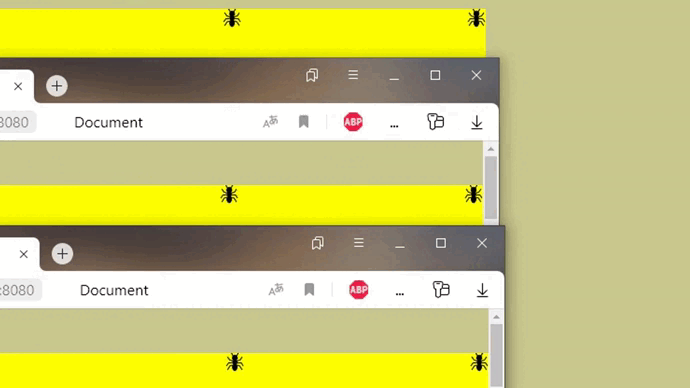

# Ready_ant_server

Графический движок "UDP"

Происходит взаимодействие движка Rust с JS

Создатель Rust движка: https://github.com/BogusKladik
# Демонстрация

# Установка

Зашли в любую папку и пишем:

```shell
git clone https://github.com/SunnBr0/Ready_ant_server
```

и после вводим

```shell
npm install 
```

чтобы скачать все зависимости

## Запуск

переходим в каталог

```shell
cd Ready_ant_server
```

Запуск симмуляции с помощью движка Rust

```shell
npm start
```

Запуск симмуляции с помощью движка JS,который был пока не появился Rust.

```
npm run prob
```

Следующий шаг - переходим в браузер и вбиваем "http://localhost:8080/"
и се ,чудо запустилось
